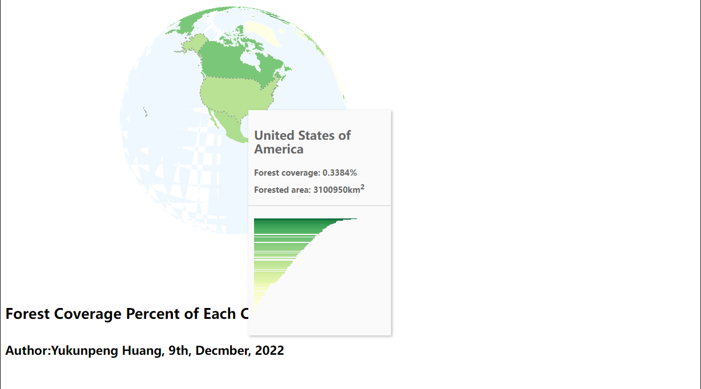

# Forest Coverage Around the World

***
>"The disappearance of forests means that we are destroying the biological treasure houses of the world. It means that we are tearing down the homes of countless species, leaving them without shelter and without food." - John F. Kennedy
***

## Project Description

The Forest Coverage Around the World project is an interactive web GIS application that allows users to explore the forest area and forest cover of countries around the world. With this tool, users can search for specific countries or regions and view detailed information on their forest coverage, including the forest area, forest cover, and annual growth. The map color-codes each country or region according to its forest coverage rate, making it easy to visualize and compare the forest data across the globe.

Please note that the forest coverage data used in this project is based on estimates and approximations, rather than precise measurements. Additionally, the data may be limited in scope or subject to various biases, such as the accuracy of the sources and the definitions and assumptions applied to the data. This project is intended to provide a general overview of the world's forest coverage, and should not be used for precise or definitive analysis.

### Project Goal

The goal of this project is to provide valuable insights into the state of the world's forests and the progress of environmental protection work. As global energy prices continue to rise, the use of wood as fuel for heating has increased in many countries. This project aims to raise awareness of the importance of protecting forests, and to help people understand the efforts being made by different countries to promote environmental protection. By providing a clear and intuitive visualization of the world's forest data, this project hopes to inspire individuals and governments to take action to protect these valuable resources.

The Forest Coverage Around the World project is designed to be of interest and value to a wide range of audiences, including governments, researchers, environmental organizations, and the general public. Each of these groups may have different reasons for using the project, and may have different needs and expectations for the data and functionality of the project. We hope that this project can provide valuable insights and inspire action to protect the world's forests and promote environmental protection.

### Main Function

The main function of the Forest Coverage Around the World project is to provide a visual representation of the forest coverage in countries around the globe. The project uses a rotating globe that can be interacted with to find and select specific countries. When a country is selected, the map color-codes the country according to its forest coverage rate, allowing viewers to easily see the difference in forest coverage across the globe. The project also includes a hover window that displays detailed information on the forest coverage of the selected country, including the forest area, forest cover, and annual growth.

Here is what application looks like:

Overall, the main function of the project is to provide an intuitive and interactive way to explore and understand the state of the world's forests, and to raise awareness of the importance of protecting these valuable resources.

### Development Process

The development process for the project began with researching and selecting the appropriate data sources and libraries to use. Once the data and libraries were in place, the project team worked on creating the map visualization, including the rotating globe and color-coded countries. The user interface and interaction elements, such as the search function and hover window, were also developed during this phase.

Throughout the development process, the project team conducted extensive testing and debugging to ensure that the map and user interface were functioning properly. The project was also reviewed and revised based on feedback from mentors and peers.

### Acknowledgment

The Forest Coverage Around the World project would not have been possible without the generous support and resources provided by the following organizations and individuals:
*The data for this project was sourced from the Wikipedia page on [List of Countries by Forest Area](https://en.wikipedia.org/wiki/List_of_countries_by_forest_area). We would like to thank the contributors to this page for their valuable data.

*The project uses several open-source libraries, including json, css, javascrpt, d3, topojson, and html. We would like to thank the developers of these libraries for their hard work and dedication in creating these valuable resources.

*The project is hosted on [github](https://github.com/). We would like to thank github for providing the webspace and tools to make this project possible.

We would also like to thank the University of Washington for providing the support and resources that allowed us to pursue this project. Finally, we would like to thank all those who have contributed to the development and success of this project, including our peers, mentors, and advisors. Thank you all for your support and guidance.
